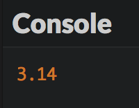

VARIABLES
=========


Vous savez maintenant afficher des valeurs avec JavaScript. Mais pour
qu'un programme soit véritablement utile, il faut qu'il puisse mémoriser
des données, par exemple des informations saisies par un utilisateur.
C'est l'objet de ce chapitre.

Rôle des variables
------------------

Un programme informatique mémorise des données en utilisant des
variables. Une **variable** est une zone de stockage d'information. On
peut l'imaginer comme une boîte dans laquelle on range des choses.

Propriétés d'une variable
-------------------------

Une variable possède trois grandes propriétés :

-   Son **nom**, qui permet de l'identifier. Un nom de variable peut
    contenir des lettres majuscules ou minuscules, des chiffres (sauf en
    première position) et certains caractères comme le dollar (`$`) ou
    le tiret bas, appelé underscore (`_`).
-   Sa **valeur**, qui est la donnée actuellement mémorisée dans cette
    variable.
-   Son **type**, qui détermine le rôle et les opérations applicables à
    cette variable.

> JavaScript n'impose pas de définir le type d'une variable. Ce type est
> déduit de la valeur stockée dans la variable, et peut donc changer au
> fur et à mesure de l'exécution du programme : on dit que JavaScript
> est un langage à typage **dynamique**. D'autres langages comme C ou
> Java imposent la définition du type des variables. On parle alors de
> typage **statique**.

Déclarer une variable
---------------------

Avant de pouvoir stocker des informations dans une variable, il faut la
créer. Cette opération s'appelle la **déclaration** de la variable. Au
niveau de l'ordinateur, déclarer une variable déclenche la réservation
d'une zone de la mémoire attribuée à cette variable. Le programme peut
ensuite lire ou écrire des données dans cette zone mémoire en manipulant
la variable.

Voici un exemple de code qui déclare une variable puis affiche sa
valeur.

``` js
let a;
console.log(a);
```

En JavaScript, on déclare une variable à l'aide du mot-clé `let` suivi
du nom de la variable. Dans cet exemple, la variable créée se nomme `a`.

> Dans les versions précédentes du langage, on déclarait une variable
> avec le mot-clé `var`. C'st toujours possible, mais sans rentrer dans
> des détails complexes, `let` et `const` le remplacent avantageusement.

Voici le résultat produit par l'exécution de ce programme.


On constate que le résultat affiché est `undefined`. Il s'agit d'un type
JavaScript qui indique l'absence de valeur. Immédiatement après sa
déclaration, une variable JavaScript n'a pas de valeur, ce qui est
logique.

Affecter une valeur à une variable
----------------------------------

Au cours du déroulement du programme, la valeur stockée dans une
variable peut changer. Pour donner une nouvelle valeur à une variable,
on utilise l'opérateur `=`, appelé **opérateur d'affectation**.

``` javascript
let a;
a = 3.14;
console.log(a);
```

Le résultat de son exécution est le suivant.



La valeur de la variable `a` été modifiée par l'opération d'affectation.
La ligne `a = 3.14` se lit "a reçoit la valeur 3,14".

> Attention à ne pas confondre l'opérateur d'affectation `=` avec
> l'égalité mathématique ! Nous verrons prochainement comment exprimer
> une égalité en JavaScript.

On peut également combiner déclaration et affectation d'une valeur en
une seule ligne. Il est cependant important de bien distinguer leurs
rôles respectifs. Le programme ci-dessous est strictement équivalent au
précédent.

``` js
let a = 3.14;
console.log(a);
```

Déclarer une variable constante
-------------------------------

Si la valeur initiale d'une variable ne changera jamais au cours de
l'exécution du programme, cette variable est ce qu'on appelle une
**constante**. Il vaut alors mieux la déclarer avec le mot-clé `const`
plutôt qu'avec `let`. Cela rend le programme plus facile à comprendre,
et cela permet aussi de détecter des erreurs.

``` js
const a = 3.14; // La valeur de a ne pourra plus évoluer
a = 6.28; // Impossible !
```


Portée d'une variable
---------------------

On appelle **portée** (*scope*) d'une variable la portion du code source
dans laquelle cette variable est visible et donc utilisable. Les
variables déclarées avec `let` et `const` ont une portée de type bloc :
elles ne sont visibles qu'au sein du bloc de code dans lequel elles sont
déclarées (ainsi que dans tous les sous-blocs éventuels). En JavaScript
et dans de nombreux autres langages, un **bloc de code** est délimité
par une paire d'accolades ouvrante et fermante. Un programme JavaScript
correspond par défaut à un unique bloc de code.

``` js
let var1 = 0;
{
    var1 = 1; // OK : var1 est déclarée dans le bloc parent
    const var2 = 0;
}
console.log(var1); // OK : var1 est déclarée dans le bloc courant
console.log(var2); // Erreur : var2 n'est pas visible ici
```

Importance du nommage des variables
-----------------------------------

Pour clore ce chapitre, j'aimerais insister sur un aspect parfois
négligé par les développeurs débutants : le nommage des variables. Le
nom choisi pour une variable n'a pour la machine aucune importance, et
le programme fonctionnera de manière identique. Rien n'empêche de nommer
toutes ses variables `a`, `b`, `c`..., voire de choisir des noms
absurdes comme `steackhache` ou `jesuisuncodeurfou`.

Et pourtant, la manière dont sont nommées les variables affecte
grandement la facilité de compréhension d'un programme. Observez ces
deux versions du même exemple.

``` js
const nb1 = 5.5;
const nb2 = 3.14;
const nb3 = 2 * nb2 * nb1;
console.log(nb3);
```

``` js
const rayon = 5.5;
const pi = 3.14;
const perimetre = 2 * pi * rayon;
console.log(perimetre);
```

Leur fonctionnement est strictement identique, et pourtant la
compréhension du second est beaucoup plus rapide grâce aux noms choisis
pour ses variables.
