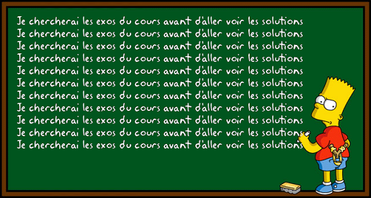
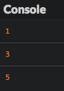

Les boucles
===========


L'objectif de ce chapitre est d'apprendre comment ajouter à nos
programmes des possibilités d'exécution répétitive.

Introduction
------------

Essayons de créer un programme qui affiche tous les nombres entre 1 et
5. Voici ce que nous pouvons écrire avec nos connaissances actuelles.

``` js
console.log(1);
console.log(2);
console.log(3);
console.log(4);
console.log(5);
```

Même s'il reste relativement court, ce programme est très répétitif. Que
se passerait-il si nous devions afficher non pas 5, mais 100 ou même
1000 nombres ? On doit pouvoir faire mieux.

Pour cela, le langage JavaScript offre la possibilité de répéter
l'exécution d'un ensemble d'instructions en plaçant ces instructions à
l'intérieur d'une **boucle**. Le nombre de répétitions peut être connu à
l'avance ou dépendre de l'évaluation d'une condition. A chaque
répétition, les instructions contenues dans la boucle sont exécutées.
C'est ce qu'on appelle un **tour de boucle** ou encore une
**itération**.



Nous allons étudier les deux grands types de boucles utilisables en
JavaScript ainsi que dans la plupart des autres langages de
programmation.

La boucle `while`
-----------------

La boucle `while` permet de répéter des instructions **tant qu'une
condition est vérifiée**.

### Exemple d'utilisation

Voici notre programme d'exemple réécrit avec une boucle while.

``` js
let nombre = 1;
while (nombre <= 5) {
    console.log(nombre);
    nombre++;
}
```

Exactement comme le précédent, il affiche les nombres entre 1 et 5 dans
la console.


### Fonctionnement

La syntaxe de l'instruction `while` est la suivante.

``` javascript
while (condition) {
    // instructions exécutées tant que la condition est vérifiée
}
```

Avant chaque tour de boucle, la condition associée au `while` est
évaluée.

-   Si elle est vraie, les instructions du bloc de code associé au
    `while` sont exécutées. Ensuite, l'exécution revient au niveau du
    `while` et la condition est à nouveau vérifiée.

-   Si elle est fausse, les instructions du bloc ne sont pas exécutées
    et le programme continue juste après le bloc `while`.

Le bloc d'instructions associé à une boucle est appelé le **corps de la
boucle**.

> Le corps de la boucle doit être placé entre accolades, sauf s'il se
> réduit à une seule instruction. Dans un premier temps, je vous
> conseille d'ajouter systématiquement des accolades à toutes vos
> boucles.

Dans l'exemple précédent, la valeur du la variable `nombre` est affichée
tant que cette valeur ne dépasse pas 5. Lorsque c'est le cas, la boucle
`while` se termine.

La boucle `for`
---------------

On a fréquemment besoin d'écrire des boucles dont la condition est basée
sur la valeur d'une variable qui est modifiée dans le corps de la
boucle, comme dans notre exemple précédent. Pour répondre à ce besoin,
JavaScript et la plupart des autres langages disposent d'un autre type
de boucle : le `for`.

### Exemple d'utilisation

Voici notre programme d'exemple réécrit avec une boucle `for`.

``` js
let nombre;
for (nombre = 1; nombre <= 5; nombre++) {
    console.log(nombre);
}
```

Cet exemple donne exactement le même résultat que les précédents.

### Fonctionnement

La syntaxe de l'instruction `for` est la suivante.

``` js
for (initialisation; condition; étape) {
    // instruction executées tant que la condition est vérifiée
}
```

Son fonctionnement est un peu plus complexe que celui d'un `while`.
Lisez attentivement ce qui suit :

-   L'**initialisation** se produit une seule fois, au début de
    l'exécution.

-   La **condition** est évaluée *avant* chaque tour de boucle. Si elle
    est vraie, un nouveau tour de boucle est effectué. Sinon, la boucle
    est terminée.

-   L'**étape** est réalisée *après* chaque tour de boucle.

Le plus souvent, on utilise l'initialisation pour définir la valeur
initiale d'une variable qui sera impliquée dans la condition de la
boucle. L'étape sert à modifier la valeur de cette variable.

Dans l'exemple précédent, l'initialisation définit la valeur initiale de
la variable `nombre`. La condition permet de rester dans la boucle tant
que `nombre` est inférieur ou égal à 5. l'étape incrémente `nombre` de 1
après que le corps de la boucle ait affiché la valeur de cette variable.

### Compteur de boucle

La variable utilisée dans l'initialisation, la condition et l'étape
d'une boucle `for` est appelée le **compteur** de la boucle.

> Par convention, la variable compteur d'une boucle for est souvent
> nommée `i`.

Très souvent, on n'a pas besoin d'utiliser la variable compteur en
dehors du corps de la boucle. Dans ce cas, on peut la déclarer en même
temps qu'on l'initialise dans la boucle. Dans ce cas, sa portée se
limite à la boucle. Notre programme d'exemple peut être réécrit ainsi :

``` js
for (let nombre = 1; nombre <= 5; nombre++) {
    console.log(nombre);
}
// La variable nombre n'est plus visible ici
```

Erreurs fréquentes
------------------

### Boucle `while` infinie

Le principal risque lié à la boucle while est la "boucle infinie". Il
s'agit d'une erreur de programmation très facile à commettre, donc
dangereuse.

Voici l'exemple de boucle `while` modifié pour oublier volontairement la
ligne qui incrémente la variable `nombre`.

``` js
let nombre = 1;
while (nombre <= 5) {
    console.log(nombre);
    // La variable n'est plus modifiée : la condition restera toujours vraie
}
```

Ce programme affiche indéfiniment le nombre 1. Lors de son exécution, on
fait un premier tour de boucle puisque la condition `(nombre <= 5)` est
initialement vérifiée. Mais comme on ne modifie plus la variable
`nombre` dans le corps de la boucle, la condition reste indéfiniment
vraie : il s'agit d'une boucle infinie.

Pour éviter d'écrire par mégarde une boucle infinie, il faut s'assurer
que la variable impliquée dans la condition puisse être modifiée dans le
corps de la boucle.

### Manipulation du compteur d'une boucle `for`

Imaginons qu'une inspiration bizarre vous conduise à modifier le
compteur d'une boucle `for` dans le corps de la boucle, comme dans
l'exemple suivant.

``` js
for (let i = 1; i <= 5; i++) {
    console.log(i);
    i++; // La variable i est modifiée dans le corps de la boucle
}
```

L'exécution de cet exemple produit le résultat suivant.



A chaque tour de boucle, la variable `i` est incrémentée deux fois :
dans le corps de la boucle, puis dans l'étape exécutée à la fin de
chaque tour.

Quand on emploie une boucle `for`, la modification du compteur de boucle
(le plus souvent une incrémentation) est réalisée à la fin de chaque
tour de boucle. Sauf exception rarissime, Il ne faut surtout pas
modifier le compteur dans le corps de la boucle.

Choix entre un `while` et un `for`
----------------------------------

Comment choisir le type de boucle à utiliser lorsqu'on doit répéter des
instructions dans un programme ?

La boucle `for` a l'avantage d'intégrer la modification du compteur dans
sa syntaxe, ce qui élimine le problème des boucles infinies. En
revanche, son utilisation implique que le nombre de tours de boucle soit
connu à l'avance. Les scénarios où le nombre de tours ne peut pas être
prévu à l'avance seront plus simples à écrire avec un `while`. C'est
notamment le cas lorsque la boucle sert à contrôler une donnée saisie
par l'utilisateur, comme dans cet exemple.

``` js
let lettre = "";
while (lettre !== "X") {
    lettre = prompt("Tapez une lettre ou X pour sortir :");
}
```

Ce programme demande à l'utilisateur de saisir une lettre jusqu'à ce
qu'il tape "X". Le nombre de tours de boucle dépend de vos saisies : il
est imprévisible.

Voici le même programme, écrit avec un `for`.

``` javascript
let lettre = "";
for (; lettre !== "X";) {
    lettre = prompt("Tapez une lettre ou X pour sortir :");
}
```

On utilise uniquement la condition de sortie et pas l'initialisation ni
l'étape : autant choisir la boucle `while`.

En conclusion, le choix entre un `while` et un `for` dépend du contexte.
Toutes les boucles peuvent s'écrire avec un `while`. Si on peut prévoir
à l'avance le nombre de tours de boucles à effectuer, la boucle `for`
est le meilleur choix. Sinon, il vaut mieux utiliser le `while`.
