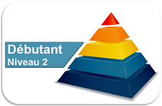

Javascript - débutant
=====================

Sommaire
--------

[Chap 1 - Variables](01-Variables.md)

[Chap 2 - Types et valeurs](02-TypesValeurs.md)

[Chap 3 - IHM](03-IHM.md)

[Chap 4 - Calculs](04-Calculs.md)

[Chap 5 - Conditions](05-Conditions.md)

[Chap 6 - Fonctions](06-Fonctions.md)

[Chap 7 - Boucles](07-Boucles.md)
